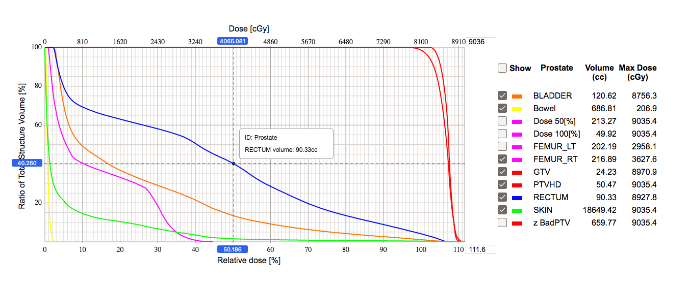

# Dose Volume Histogram

An example of a [dose-volume histogram](https://en.wikipedia.org/wiki/Dose-volume_histogram) using React.

## Running

1. `yarn install`
2. `yarn dev:api`
3. `yarn dev:ui`
4. Navigate to http://localhost:8080
